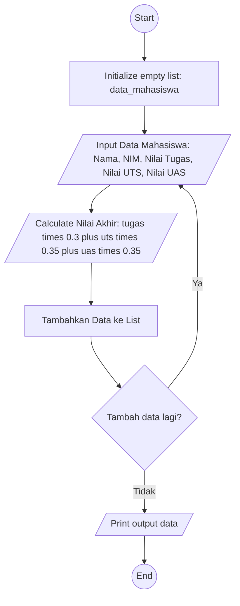

```mermaid
graph TD
    Start((Start))
    InitList[Initialize empty list: data_mahasiswa ]
    InputData[/Input Data Mahasiswa: Nama, NIM, Nilai Tugas, Nilai UTS, Nilai UAS/]
    CalculateNilai[/Calculate Nilai Akhir: tugas times 0.3 plus uts times 0.35 plus uas times 0.35/]
    AddToList[Tambahkan Data ke List]
    Decision{Tambah data lagi?}
    PrintData[/Print output data/]
    End((End))

    Start --> InitList
    InitList --> InputData
    InputData --> CalculateNilai
    CalculateNilai --> AddToList
    AddToList --> Decision
    Decision -- Ya --> InputData
    Decision -- Tidak --> PrintData
    PrintData --> End
```
